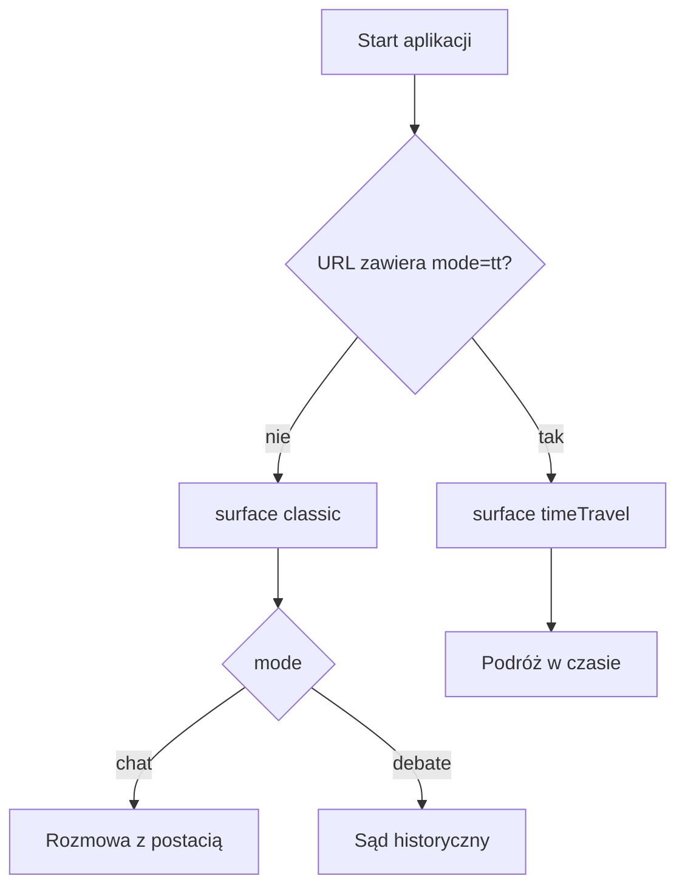

# Plan wdrożenia: „Podróż w czasie” (HistoryChat)

**Status:** dokument roboczy — do akceptacji przed implementacją.  
**Cel:** przenieść funkcjonalność z folderu [`podroz wczasie`](../podroz%20wczasie/) do głównej aplikacji, **bez utraty trybu Sąd historyczny (debata)** i przy **jawnej jakości kodu** + pracy zgodnej z metodyką Superpowers (najpierw zrozumienie i kontrakt, potem backend z testami, potem frontend, na końcu weryfikacja).

**„Obok” repozytorium:** to jest **źródłowy plan przy kodzie** — plik w [`docs/`](../docs/) obok aplikacji, niezależnie od osobnego planu Cursor w katalogu planów IDE. W opisie PR warto wkleić link do tego pliku.

**Spis treści:** kontekst (§1) → UX nested toggle (§2) → kontrakt API (§3) → pliki (§4) → kolejność prac (§5) → gałąź / PR / commity (§6) → Superpowers (§7) → ryzyka (§8) → definicja done (§9).

---

## 1. Kontekst techniczny

| Obszar | Stan głównego projektu | Stan `podroz wczasie` |
|--------|------------------------|------------------------|
| Frontend | `chat` / `debate` w [`src/App.tsx`](../src/App.tsx), [`ModeSwitch`](../src/components/ModeSwitch.tsx), [`DebateSection`](../src/components/DebateSection.tsx) | `classic` / `timeTravel`, przycisk TT w sidebarze, `?mode=tt` w URL |
| Backend | Brak endpointów time-travel w [`backend/api/routes.py`](../backend/api/routes.py) | Frontend oczekuje konkretnych ścieżek API (patrz §3) |
| Assety | Brak `public/data/scenes-catalog.json` | Plik obecny pod `public/data/` |

**Wniosek:** samo skopiowanie UI **nie wystarczy** — trzeba zaprojektować i wdrożyć **backend + dane (`characters.json`)** oraz scalić **stan nawigacji** (classic + TT + debata).

---

## 2. UX (uzgodniony wariant: nested toggle)

- **`surface`: `classic` | `timeTravel`**
  - `timeTravel`: w main renderowany jest komponent **`TimeTravelSection`** (z `podroz wczasie`); lista postaci po lewej **ukryta** (jak w prototypie), żeby nie mylić trybów.
  - `classic`: dotychczasowe zachowanie z **`mode`: `chat` | `debate`**.
- **Gdy `surface === timeTravel`:** **`ModeSwitch` (Rozmowa / Sąd) ukryty** — debata i TT naraz są mylące; powrót do `classic` przywraca ostatnio wybrany `mode`.
- **URL:** synchronizacja `?mode=tt` ↔ `surface === timeTravel` (jak w prototypie), bez zmiany modelu SPA poza query.
- **`Sidebar`:** przyciski: przełączenie Podróż w czasie ↔ tryb klasyczny **oraz** (tylko w classic) **`ModeSwitch`**.

Diagram przepływu:

---

## 3. Kontrakt API (wymóg spójny z frontendem z `podroz wczasie`)

Stałe walidacji (rok, długość miejsca, długość wiadomości) muszą być **zgodne** z [`podroz wczasie/src/constants/timeTravel.ts`](../podroz%20wczasie/src/constants/timeTravel.ts) i duplikatów stałych w backendzie — komentowane odsyłacze „zgodnie z backend”.

1. **`GET /api/characters/time-travel-meta`**  
   JSON: mapa `characterId → { start_year, end_year, locations, ... }` (tylko postacie z metadanymi TT).

2. **`POST /api/chat/time-travel`**  
   Body m.in.: `characterId`, `message`, `history`, **`year` (number)**, **`location` (string)**, opcjonalnie `sourceStem`, `returningVisitor`.  
   - Walidacja wejścia (400/422 jak w reszcie API).  
   - **Reguła sceny:** rok w oknie życia/postaci z metadanych **oraz** dopasowanie miejsca jak w `filterCharacterIdsForTimeTravel` (substring, case-insensitive, obie strony).  
   - Przy odrzuceniu sceny: **422** + `error_code: "scene_not_allowed"` + `user_message` (obsługa w `useTimeTravelChat`).

3. **`POST /api/time-travel/suggest-scene`**  
   Body: `year`, opcjonalnie `regionToken`.  
   Odpowiedź: `{ "places": string[] }` — **bez zewnętrznych API**; heurystyka z metadanych postaci + (opcjonalnie) odczyt **lokalnego** `scenes-catalog.json` (kopia w `public/data/` lub lustrzana w `data/` dla backendu).

**Źródło prawdy metadanych:** [`data/time_travel/characters.json`](../data/time_travel/characters.json) (wszystkie `char_id` z README / `CHARACTERS`).  
**Merge do listy postaci:** w odpowiedzi `GET /api/characters` pole `time_travel` jak w typach prototypu — bez edycji wygenerowanego [`backend/core/characters.py`](../backend/core/characters.py).

**Prompting:** nowa funkcja (np. `build_prompt_time_travel`) w [`backend/core/prompting.py`](../backend/core/prompting.py) — ten sam blok fragmentów RAG co w zwykłym czacie, dodany kontekst roku/miejsca/perspektywy/hintów i ewentualnie „returning visitor”.

---

## 4. Zakres plikowy (implementacja po akceptacji planu)

**Backend**

- Nowy moduł pomocniczy (np. `backend/core/time_travel.py`): wczytanie JSON, dopasowanie miejsca, walidacja sceny.
- Rozszerzenie [`backend/api/routes.py`](../backend/api/routes.py): trzy endpointy + enrich `GET /api/characters`.
- Opcjonalnie: rozszerzenie wpisu w `chat_history.jsonl` o `year`/`location` przy TT ( pola opcjonalne).

**Frontend**

- Kopia 1:1 z `podroz wczasie`: `TimeTravel*.tsx`, `useTimeTravelChat.ts`, `constants/timeTravel.ts`, `utils/timeTravel*.ts`, `installTimeTravelAnalytics.ts`.
- Scalanie: [`src/types.ts`](../src/types.ts), [`src/utils/utils.ts`](../src/utils/utils.ts), [`src/components/index.ts`](../src/components/index.ts), [`src/App.tsx`](../src/App.tsx), [`src/components/Sidebar.tsx`](../src/components/Sidebar.tsx), [`src/main.tsx`](../src/main.tsx) (instalacja analytics bridge).
- Statyczne: [`public/data/scenes-catalog.json`](../public/data/scenes-catalog.json) (kopia z prototypu).

**Dokumentacja**

- [`docs/api_contract.md`](api_contract.md), krótkie uzupełnienia [`ARCHITEKTURA.md`](ARCHITEKTURA.md) / [`STRUKTURA.md`](STRUKTURA.md).

**Testy**

- Nowy plik np. `backend/tests/test_time_travel.py`: meta endpoint, `suggest-scene`, **422 `scene_not_allowed`** bez wywołania LLM; ewentualnie happy path z mockiem `call_llm` (wzorzec jak w [`test_debate.py`](../backend/tests/test_debate.py)).

---

## 5. Kolejność realizacji (zalecana)

1. **Dane:** szkic + review `data/time_travel/characters.json` (wszystkie postacie, sensowne przedziały lat i lista miejsc pod dopasowanie polskich wpisów użytkownika).  
2. **Backend + pytest** (endpointy, scena, prompt TT).  
3. **Frontend + assety + integracja `App` / `Sidebar` / URL.**  
4. **Dokumentacja API + smoke test ręczny:** TT, powrót classic, debata, czat.  
5. **`npm run lint` + `npm run build`**, uruchomienie `pytest` dla backendu.

---

## 6. Workflow git (oddzielna gałąź, oddzielny PR, kilka commitów)

Wdrożenie robimy na **osobnej gałęzi** i wystawiamy **osobny PR**. Jeśli zmian będzie dużo, rozbijamy je na **kilka logicznych commitów**, aby ułatwić review i ewentualny rollback.

- **Gałąź**: np. `feature/time-travel` (lub `feat/time-travel`).
- **PR**: tylko „Podróż w czasie” (bez dorzucania innych porządków).
- **Proponowany podział commitów** (minimum):
  - **Commit 1 — assety + dane**: `public/data/scenes-catalog.json` + szkic `data/time_travel/characters.json` (nawet jeśli na start tylko część postaci, ale jawnie).
  - **Commit 2 — backend: meta + suggest**: `GET /api/characters/time-travel-meta` i `POST /api/time-travel/suggest-scene` + moduł pomocniczy `time_travel` (bez wpinania do UI).
  - **Commit 3 — backend: chat time-travel**: `POST /api/chat/time-travel` + prompting + walidacja sceny.
  - **Commit 4 — backend testy**: `backend/tests/test_time_travel.py` (co najmniej `scene_not_allowed`).
  - **Commit 5 — frontend integracja**: przeniesienie plików TT + scalanie `App/Sidebar/types/utils/main`.
  - **Commit 6 — docs + weryfikacja**: aktualizacja `docs/api_contract.md` (+ ewentualnie architektura) oraz zapis „test plan” w opisie PR.

W razie potrzeby można dodać mikro-commity (np. „eslint/tsc fixes”), ale utrzymujemy je **tematycznie**.

---

## 7. Metodyka Superpowers (skrót)

- Krótki opis designu (stany UI + kontrakt) zanim powstanie duży diff.  
- Nie scalać „na ślepo” gigantycznego `TimeTravelSection.tsx` z innymi refaktorami — tylko niezbędne propsy pod nowy `App`/`Sidebar`.  
- Dowód działania: test sceny zabronionej + ręczny scenariusz użytkownika.

---

## 8. Ryzyka

- **Słabe metadane** → puste wyniki lub zbyt częste `scene_not_allowed`: wymaga iteracji na `characters.json` (nie na siłę w UI).  
- **Koszt utrzymania:** zmiany limitów roku/długości — aktualizować **razem** `constants/timeTravel.ts` i backend.

---

## 9. Checklist „done” (definicja ukończenia)

- [ ] Wszystkie trzy endpointy TT działają i są opisane w `api_contract.md`.  
- [ ] `GET /api/characters` zawiera `time_travel` zgodnie z typem frontendu.  
- [ ] `surface` + `mode` + URL `?mode=tt` działają bez konfliktu z debatą.  
- [ ] `pytest` obejmuje przynajmniej odrzucenie sceny (`scene_not_allowed`).  
- [ ] `npm run build` i podstawowy smoke test przechodzą.

---

*Powiązany plan w Cursorze: `wdrożenie_podróży_w_czasie_98fa30dd.plan.md` (katalog planów Cursor).*
